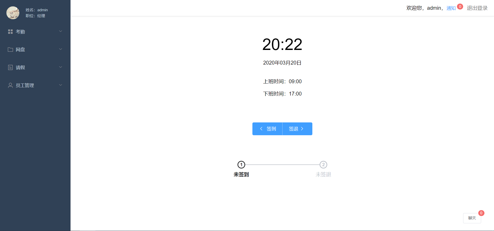
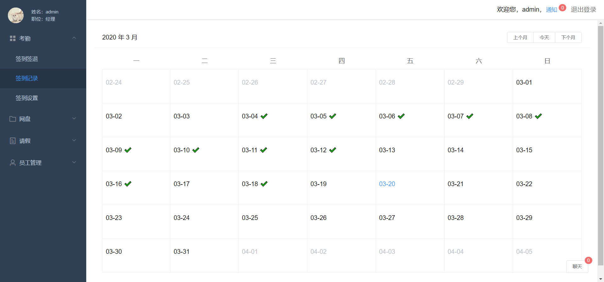
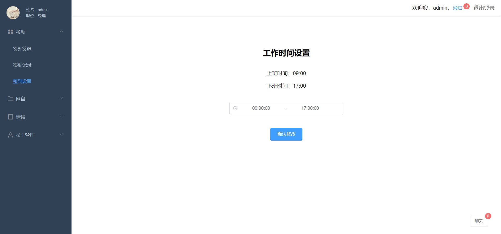
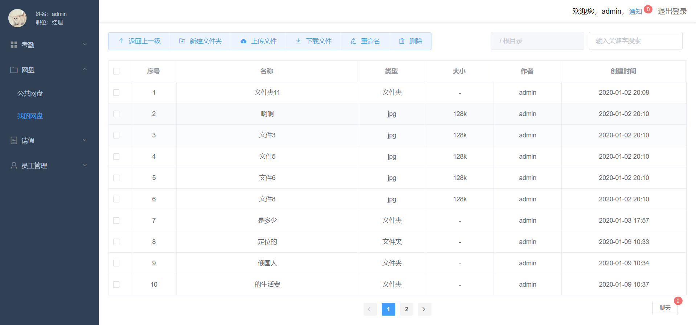
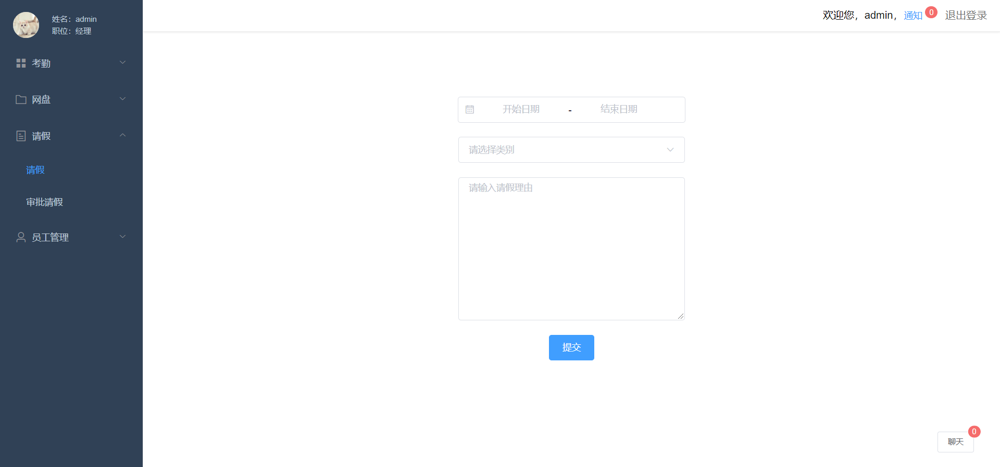
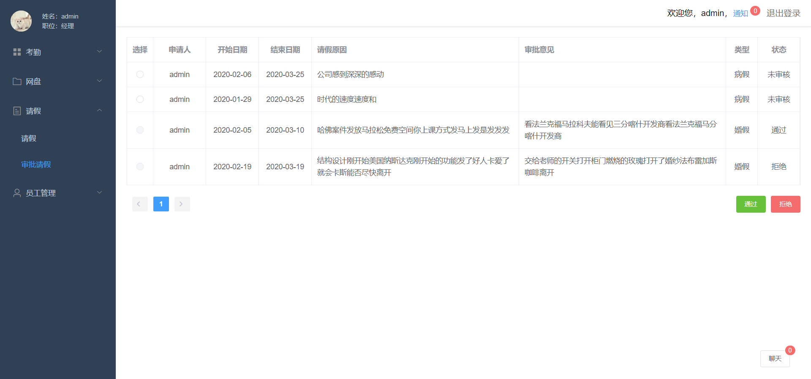
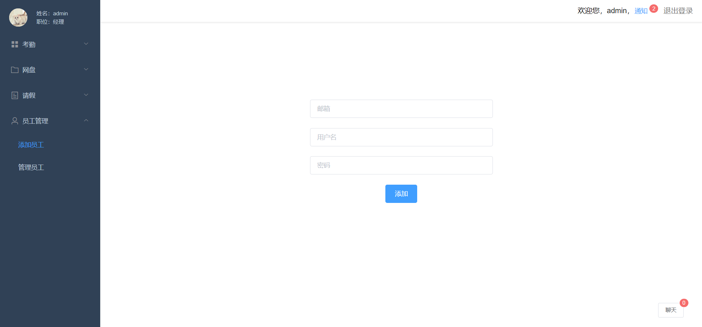
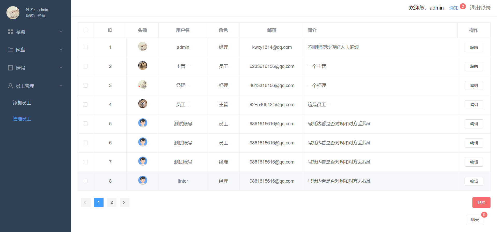
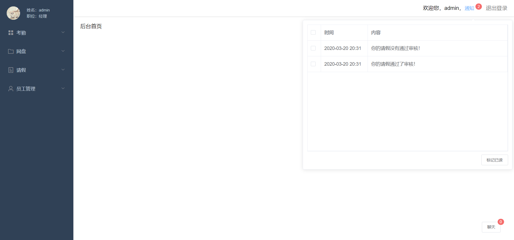
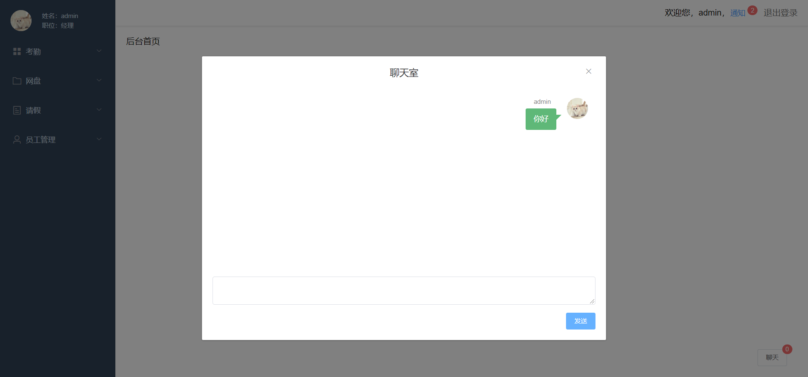

# OASys
基于SpringBoot和Vue的OA管理系统
## 前端项目地址
https://github.com/citrucn/OASys-Frontend
## 码云仓库地址
https://gitee.com/iwxy/OASys
## 数据库SQL文件
src/main/resources/oasys.sql 
## 初始账号密码
账号: admin 密码: admin
## 功能模块截图
#### 登录

#### 签到签退

#### 签到记录

#### 签到设置

#### 网盘

#### 请假

#### 审批请假

#### 添加员工

#### 管理员工

#### 消息通知

#### 聊天室

